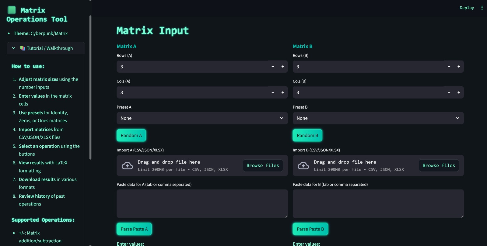
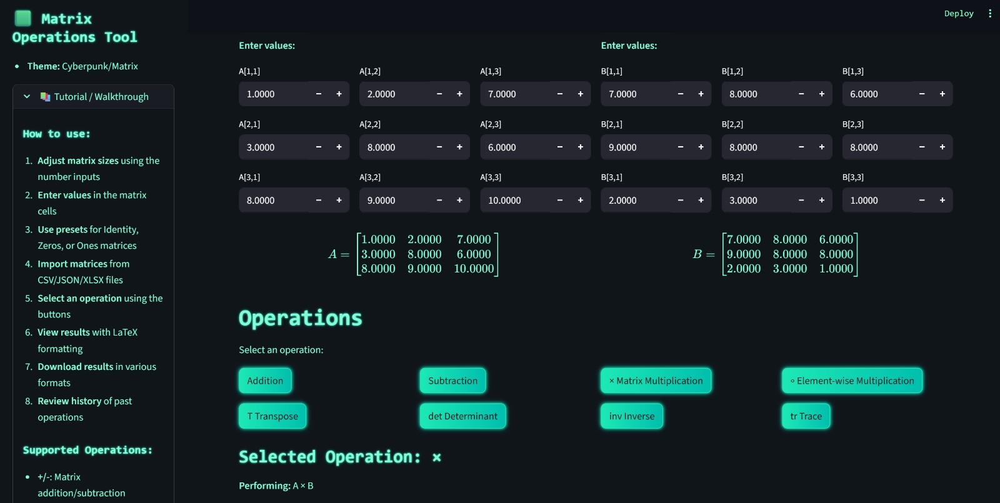
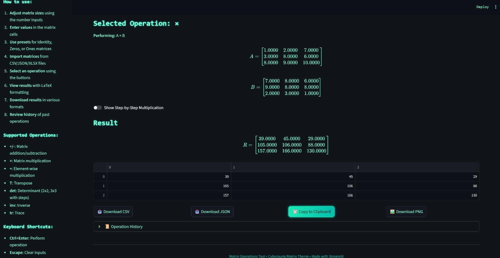

# 🟩 Matrix Operations Tool - Cyberpunk Themed

**An interactive, educational matrix calculator with a Cyberpunk/Matrix theme** built using Streamlit and NumPy. Perfect for students, educators, and linear algebra enthusiasts.

## 🚀 Features

### 🧮 Matrix Operations
- **Basic**: Addition, Subtraction, Matrix Multiplication
- **Advanced**: Element-wise Multiplication, Transpose, Determinant, Inverse, Trace
- **Educational**: Step-by-step visualizations for learning concepts

### 📊 Matrix Input Methods
- **Dynamic Sizing**: Adjust from 2×2 to 6×6 in real-time
- **Multiple Inputs**: Manual entry, random generation, presets (Identity, Zeros, Ones)
- **File Import**: CSV, JSON, Excel file support
- **Copy-Paste**: Direct paste from spreadsheets

### 🎨 Professional Features
- **Cyberpunk UI**: Neon green theme with digital rain effect
- **Real-time LaTeX**: Professional mathematical formatting
- **Operation History**: Track and replay past calculations
- **Export Options**: Download results as CSV, JSON, or PNG
- **Keyboard Shortcuts**: Ctrl+Enter for operations, Escape to clear

## 📸 Application Walkthrough

### 1. Configure Matrix Dimensions

*Set the size of matrices A and B (from 2×2 to 6×6) using intuitive controls.*

### 2. Enter Matrix Values
  
*Input matrix elements manually or use features like random generation, identity matrices, zeros, ones, or import from files.*

### 3. Perform Operations & View Results

*Select from various operations and see instant results with LaTeX formatting and step-by-step visualizations.*

## 🛠️ Installation & Usage

### Local Installation
```bash
# Clone repository
git clone https://github.com/Ramyasai07/matrix-operations-tool.git
cd matrix-operations-tool

# Install dependencies
pip install -r requirements.txt

# Run the app
streamlit run app.py
